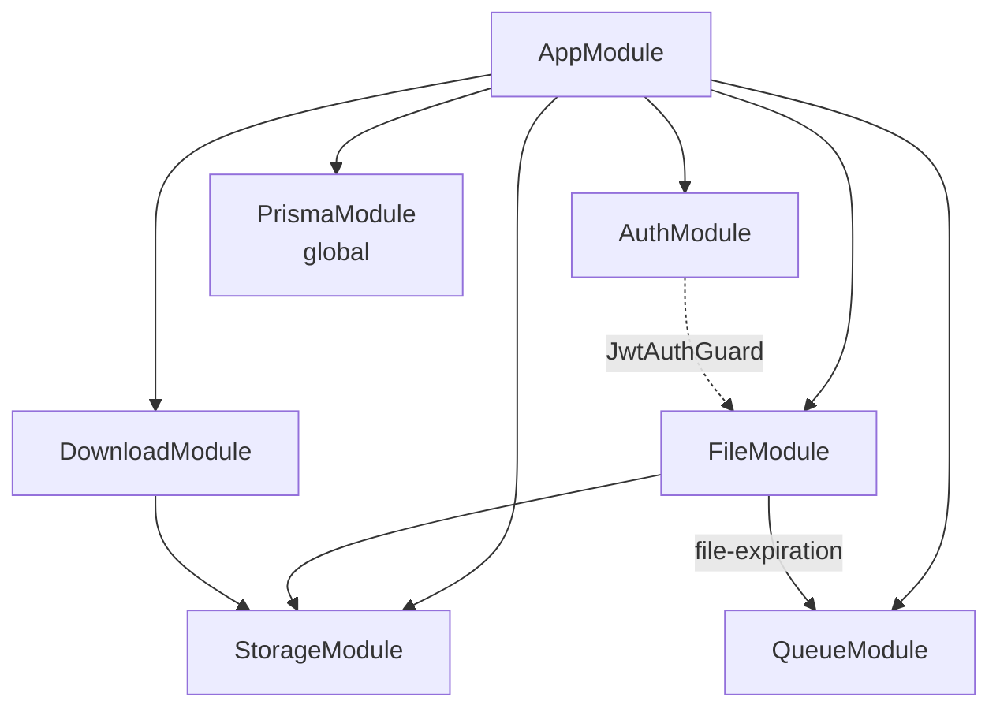
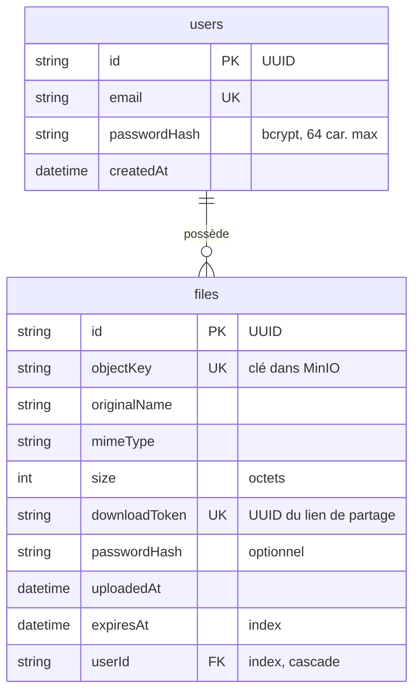
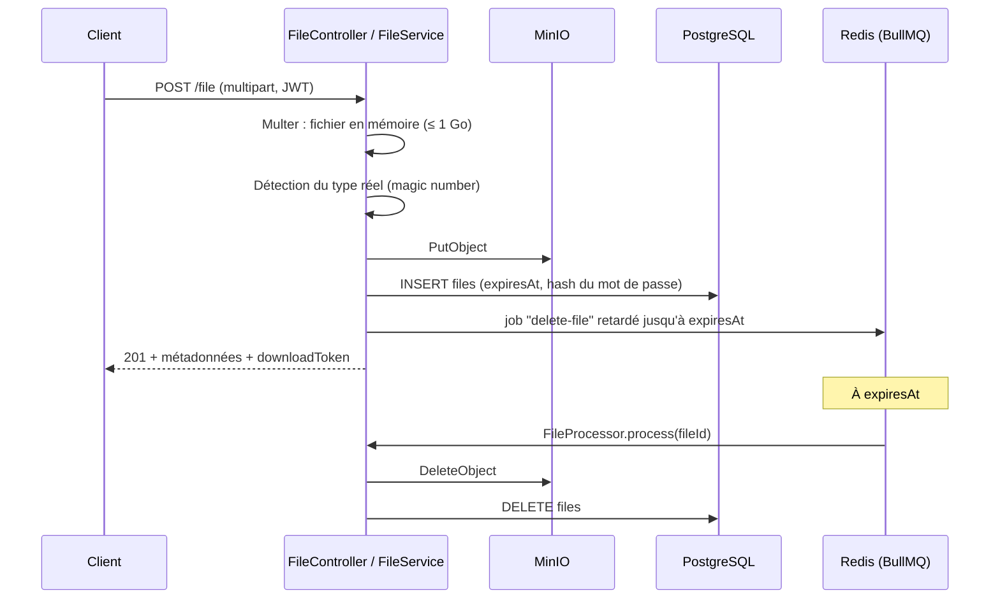

# Backend

Le backend est une API REST écrite avec **NestJS 11** sur Express 5. Il gère l'authentification, le stockage des fichiers et leur expiration automatique. La liste complète des routes est dans [API (OpenAPI)](api.md).

## Structure du dossier

```text
backend/
├── prisma/
│   └── schema.prisma            # Modèle de données (User, File)
├── prisma7.config.ts            # Configuration Prisma (schéma, migrations, DATABASE_URL)
├── src/
│   ├── main.ts                  # Démarrage : CORS, ValidationPipe, Swagger UI (dev)
│   ├── app.module.ts            # Module racine, importe tous les modules
│   ├── generate-openapi.ts      # Script de génération de openapi.json
│   ├── _generated/prisma/       # Client Prisma généré (non versionné)
│   ├── _prisma/                 # PrismaModule (global) + PrismaService
│   ├── auth/                    # Inscription, connexion, guard JWT
│   │   ├── dto/                 #   LoginDto, RegisterDto
│   │   └── interface/           #   JwtPayload
│   ├── file/                    # Upload, historique, suppression, expiration
│   │   ├── dto/                 #   UploadFileDto, FileResponseDto
│   │   ├── interface/           #   DeleteFileJobData
│   │   ├── utils/               #   Validation par magic number
│   │   └── file.processor.ts    #   Worker BullMQ de suppression
│   ├── download/                # Accès public par token de partage
│   │   └── dto/
│   ├── storage/                 # Accès à MinIO (API S3)
│   └── queue/                   # Connexion Redis pour BullMQ
├── test/                        # Tests d'intégration (*.int-spec.ts)
│   └── utils/                   #   createTestApp, cleanDatabase
├── openapi.json                 # Spec OpenAPI générée
└── package.json
```

Les tests unitaires (`*.spec.ts`) sont placés à côté du code qu'ils testent.

## Modules



| Module | Contenu | Responsabilité |
|---|---|---|
| `AuthModule` | `AuthController`, `AuthService`, `JwtAuthGuard` | Inscription, connexion, émission et vérification des JWT. Le `JwtModule` est enregistré en global. |
| `FileModule` | `FileController`, `FileService`, `FileProcessor` | Upload, liste des fichiers de l'utilisateur, suppression, job d'expiration. Toutes les routes sont protégées par `JwtAuthGuard`. |
| `DownloadModule` | `DownloadController`, `DownloadService` | Routes publiques : métadonnées d'un fichier et URL de téléchargement à partir du token de partage. |
| `StorageModule` | `StorageService` | Envoi, suppression et URL présignées sur MinIO avec le SDK AWS S3. |
| `QueueModule` | `BullModule.forRoot` | Connexion Redis partagée par les files BullMQ. |
| `PrismaModule` | `PrismaService` | Client Prisma connecté à PostgreSQL, disponible partout (`@Global`). |

## Modèle de données



- Supprimer un utilisateur supprime ses fichiers en base (`onDelete: Cascade`), mais pas les objets dans MinIO.
- `downloadToken` est un UUID distinct de l'`id` : le lien partagé ne révèle pas l'identifiant interne du fichier.
- La clé MinIO a la forme `<userId>/<32 caractères hexadécimaux aléatoires>-<nom d'origine>`.

## Fonctionnement

### Authentification

1. `POST /auth/register` vérifie que l'email n'existe pas, hache le mot de passe avec bcrypt (`BCRYPT_SALT_ROUND` tours, 10 par défaut) et crée l'utilisateur.
2. `POST /auth/login` compare le mot de passe avec le hash et renvoie `{ access_token }`, un JWT qui contient uniquement l'`id` de l'utilisateur et expire après `JWT_DURING` (1 h par défaut).
3. Sur les routes protégées, `JwtAuthGuard` lit l'en-tête `Authorization: Bearer <token>`, vérifie la signature et l'expiration, puis place le payload dans `request.user`.

### Upload et expiration



- La durée vient de `expiresInDays` (1 à 7), sinon de `DEFAULT_EXPIRATION_DAYS` (7 par défaut).
- Le job porte l'identifiant du fichier (`jobId = fileId`). Une suppression manuelle retire aussi le job, et un job qui ne trouve plus son fichier se termine sans erreur.

### Téléchargement

1. `GET /download/:token` renvoie les métadonnées (nom, type, taille, expiration, présence d'un mot de passe). Réponse `404` si le token est inconnu, `410` si le lien a expiré.
2. `POST /download/:token` vérifie le mot de passe si le fichier est protégé (`400` s'il manque, `401` s'il est faux), puis renvoie une URL présignée MinIO valable **5 minutes**, qui force le téléchargement avec le nom d'origine.
3. Le navigateur télécharge le fichier directement depuis MinIO.

### Route de développement

`POST /file/:id/force-expire` déclenche immédiatement le job d'expiration d'un fichier, pour tester la suppression automatique sans attendre. Elle renvoie `403` quand `NODE_ENV=production`.

## Configuration

Le backend lit ses variables dans `backend/.env` (chargé par `dotenv` dans `PrismaService`) et dans l'environnement fourni par mise (`.env` à la racine).

| Variable | Défaut dans le code | Usage |
|---|---|---|
| `DATABASE_URL` | — (obligatoire) | Connexion PostgreSQL |
| `JWT_SECRET` | — (obligatoire) | Clé de signature des JWT |
| `JWT_DURING` | `1h` | Durée de vie des JWT |
| `BCRYPT_SALT_ROUND` | `10` | Coût du hachage bcrypt |
| `DEFAULT_EXPIRATION_DAYS` | `7` | Expiration par défaut d'un fichier |
| `MINIO_ENDPOINT` / `MINIO_PORT` | `localhost` / `9000` | Adresse de MinIO |
| `MINIO_ROOT_USER` / `MINIO_ROOT_PASSWORD` | `minioadmin` / `minioadmin` | Identifiants MinIO |
| `MINIO_BUCKET_NAME` | `file-transfer` | Bucket de stockage |
| `REDIS_HOST` / `REDIS_PORT` | `localhost` / `6379` | Connexion Redis |
| `PORT` | `3000` | Port de l'API |
| `ALLOW_ORIGIN` | `*` | Origine autorisée par CORS |
| `NODE_ENV` | — | `development` active Swagger UI ; `production` désactive `force-expire` |

!!! note "Variables déclarées mais non lues"
    `MINIO_USE_SSL` et `FILE_EXPIRATION_DEFAULT_DAYS` (dans `.env.example` à la racine) ne sont pas utilisées par le code : l'URL MinIO est construite en `http://`, et l'expiration par défaut vient de `DEFAULT_EXPIRATION_DAYS`.

## Scripts npm

| Commande | Action |
|---|---|
| `npm run start:dev` | Démarre l'API en mode watch avec `NODE_ENV=development` |
| `npm run build` / `npm run start:prod` | Compile dans `dist/` puis lance la version compilée |
| `npm run lint` | ESLint avec correction automatique |
| `npm run format` | Prettier sur `src/` et `test/` |
| `npm test` | Tests unitaires |
| `npm run test:int` | Tests d'intégration |
| `npm run test:cov:merge` | Couverture unitaire + intégration fusionnée |
| `npm run docs:openapi` | Régénère `openapi.json` |
