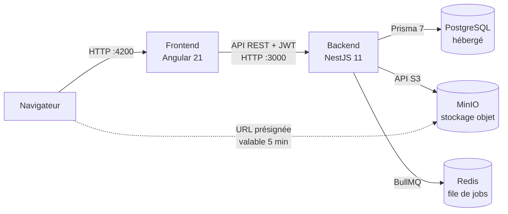

# DataShare

DataShare est une application web de **transfert de fichiers par lien temporaire**. Un utilisateur connecté téléverse un fichier (jusqu'à 1 Go), choisit une durée de validité de 1 à 7 jours et, s'il le souhaite, un mot de passe. Il obtient un lien de partage. Toute personne qui possède ce lien peut télécharger le fichier jusqu'à son expiration ; le fichier est ensuite supprimé automatiquement.

## Fonctionnalités

| User story | Fonctionnalité | Accès |
|---|---|---|
| US01 | Téléverser un fichier, avec expiration (1 à 7 jours) et mot de passe optionnel | Connecté |
| US02 | Télécharger un fichier depuis son lien de partage, avec mot de passe si le fichier est protégé | Public |
| US03 | Créer un compte | Public |
| US04 | Se connecter et se déconnecter | Public / connecté |
| US05 | Consulter l'historique de ses fichiers (actifs ou expirés) | Connecté |
| US06 | Supprimer un de ses fichiers | Connecté |

## Architecture

Le dépôt est un monorepo qui regroupe le frontend, le backend, les tests de performance et l'outillage commun.



- Le **frontend** Angular sert l'interface et appelle l'API avec un token JWT.
- Le **backend** NestJS expose l'API REST, valide les fichiers, enregistre les métadonnées en base et stocke le contenu dans MinIO.
- Chaque upload programme un **job d'expiration** dans Redis (BullMQ) qui supprime le fichier à la date prévue.
- Au téléchargement, le backend renvoie une **URL présignée** : le navigateur récupère le fichier directement dans MinIO, sans que le contenu repasse par l'API.

MinIO et Redis tournent en local via Docker Compose. La base PostgreSQL est une instance Prisma Postgres hébergée, configurée par la variable `DATABASE_URL`.

## Organisation du dépôt

```text
P4/
├── .github/            # CI : Trivy, CodeQL, Dependabot
├── backend/            # API NestJS, schéma Prisma, tests Jest
├── frontend/           # Application Angular, tests Playwright
├── k6/                 # Scénarios de performance et rapports
├── docs/               # Cette documentation (MkDocs)
├── docker-compose.yml  # MinIO + Redis
├── mise.toml           # Versions des outils et tâches du projet
├── lefthook.yml        # Hooks git (lint, commitlint)
└── mkdocs.yml          # Configuration de la documentation
```

## Outils et frameworks intégrés

Les versions exactes sont listées dans [Stack et versions](versions.md).

### Application

| Domaine | Outil | Rôle |
|---|---|---|
| Frontend | **Angular 21** | Application monopage en composants autonomes (standalone), formulaires réactifs, signals |
| Backend | **NestJS 11** (Express 5) | API REST structurée en modules, validation avec class-validator |
| Documentation d'API | **@nestjs/swagger** | Génère la spec OpenAPI à partir des décorateurs du code |
| Base de données | **PostgreSQL** + **Prisma 7** | Persistance des utilisateurs et des métadonnées de fichiers |
| Stockage de fichiers | **MinIO** (API S3, via AWS SDK v3) | Stockage objet du contenu des fichiers |
| Tâches différées | **Redis** + **BullMQ** | Suppression automatique des fichiers à expiration |
| Authentification | **JWT** (@nestjs/jwt) + **bcrypt** | Sessions sans état, mots de passe hachés |

### Tests et qualité

| Domaine | Outil | Rôle |
|---|---|---|
| Tests unitaires backend | **Jest** + ts-jest | Services et guard testés avec des dépendances simulées |
| Tests d'intégration backend | **Jest** + **Supertest** | Appels HTTP réels sur l'application complète |
| Tests unitaires frontend | **Vitest** (builder Angular) | Tests de composants |
| Tests de bout en bout | **Playwright** | Parcours utilisateur dans Chromium |
| Couverture E2E | **monocart-coverage-reports** | Couverture V8 du code Angular pendant les tests Playwright |
| Performance | **k6** (image Docker `grafana/k6`) | Tests smoke, load, stress, soak et spike sur l'upload |
| Qualité de code | **ESLint**, **typescript-eslint**, **angular-eslint**, **Prettier** | Lint et formatage |

### Outillage et CI

| Domaine | Outil | Rôle |
|---|---|---|
| Environnement | **mise** | Versions de Node et Python, variables d'environnement, tâches du projet |
| Infrastructure locale | **Docker Compose** | MinIO et Redis |
| Hooks git | **Lefthook** | Lint des fichiers modifiés et contrôle du message de commit |
| Messages de commit | **commitlint** (Conventional Commits) | Format `type(scope): message` imposé |
| Sécurité des dépendances | **Trivy** (GitHub Actions) | CVE, secrets et erreurs de configuration |
| Analyse statique | **CodeQL** (GitHub Actions) | Failles dans le code TypeScript et dans les workflows |
| Mises à jour | **Dependabot** | PR hebdomadaires de mise à jour npm et GitHub Actions |
| Documentation | **MkDocs** + **Material for MkDocs** | Ce site |

## Démarrage rapide

Prérequis : [mise](https://mise.jdx.dev), Docker, et un fichier `.env` à la racine (copié depuis `.env.example`), complété par `backend/.env` (`DATABASE_URL`, `JWT_SECRET`).

```bash
mise install          # installe Node 22, Python 3.12 et Lefthook
mise run setup        # dépendances npm (racine, backend, frontend) + hooks git
mise run dev          # démarre Docker, puis le backend (:3000) et le frontend (:4200)
```

Une fois lancé :

| Service | Adresse |
|---|---|
| Application | <http://localhost:4200> |
| API | <http://localhost:3000> |
| Swagger UI (mode développement) | <http://localhost:3000/api-docs> |
| Console MinIO | <http://localhost:9001> |

Toutes les tâches disponibles s'affichent avec `mise tasks`. Leur usage est détaillé dans [Maintenance](maintenance.md).
