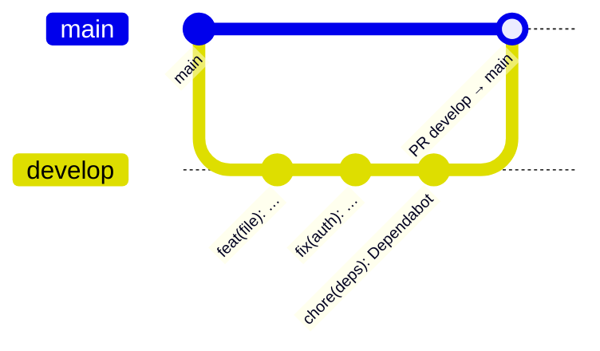

# Maintenance

Cette page regroupe les procédures pour installer, faire évoluer et dépanner le projet.

## Installer un poste de développement

1. Installer [mise](https://mise.jdx.dev) et Docker.
2. Cloner le dépôt, puis copier les fichiers d'environnement :
   ```bash
   cp .env.example .env
   cp backend/.env.example backend/.env
   ```
3. Compléter `backend/.env` : `DATABASE_URL` (base PostgreSQL) et `JWT_SECRET` (chaîne aléatoire longue, par exemple `openssl rand -base64 48`).
4. Installer les outils et les dépendances :
   ```bash
   mise install        # Node 22, Python 3.12, Lefthook
   mise run setup      # npm install (backend, frontend, racine) + hooks git
   ```
5. Générer le client Prisma et créer les tables si la base est vide :
   ```bash
   cd backend
   npx prisma generate --config prisma7.config.ts
   npx prisma db push --config prisma7.config.ts
   ```
6. Lancer l'ensemble avec `mise run dev`.

## Tâches mise

`mise tasks` affiche la liste à jour.

| Tâche | Action |
|---|---|
| `mise run setup` | Installe toutes les dépendances npm et les hooks git |
| `mise run dev` | Démarre Docker, puis le backend et le frontend |
| `mise run dev-back` / `dev-front` | Démarre uniquement le backend ou le frontend |
| `mise run docker-up` / `docker-down` | Démarre ou arrête MinIO et Redis |
| `mise run lint` | ESLint sur le backend et le frontend |
| `mise run test` | Tests unitaires du backend |
| `mise run k6 <scénario>` | Test de performance (`smoke`, `load`, `stress`, `soak`, `spike`) |
| `mise run k6-report <scénario> [nom]` | Test de performance + rapport HTML dans `k6/reports/` |
| `mise run docs-install` | Installe MkDocs et Material (`requirements-docs.txt`) |
| `mise run docs-openapi` | Régénère la spec OpenAPI et la copie dans la documentation |
| `mise run docs` | Sert la documentation sur <http://127.0.0.1:8000> avec rechargement automatique |
| `mise run docs-build` | Construit le site statique dans `site/` |

## Workflow Git



- Le travail se fait sur **`develop`**. Les versions stables sont fusionnées dans **`main`** par pull request.
- **Messages de commit** au format Conventional Commits : `type(scope): description`. Types acceptés : `build`, `chore`, `ci`, `docs`, `feat`, `fix`, `perf`, `refactor`, `revert`, `style`, `test`. Le hook `commit-msg` refuse les autres formats.
- **Avant chaque commit**, le hook `pre-commit` lance ESLint sur les fichiers modifiés du backend et du frontend.
- **Sur chaque PR**, Trivy et CodeQL s'exécutent (voir [Sécurité](securite.md)).

### Avant de fusionner une PR

- [ ] `mise run lint` sans erreur
- [ ] Tests unitaires et d'intégration du backend au vert
- [ ] Tests Playwright au vert (`npm run play:run` dans `frontend/`)
- [ ] Trivy et CodeQL au vert, pas de nouvelle alerte dans l'onglet *Security*
- [ ] Spec OpenAPI régénérée si une route ou un DTO a changé
- [ ] Documentation mise à jour si le fonctionnement a changé

## Mettre à jour les dépendances

### PR Dependabot

Chaque lundi, Dependabot ouvre des PR vers `develop`. Pour chacune :

1. Lire le résumé de la PR (notes de version, changements majeurs).
2. Attendre le résultat de Trivy et CodeQL.
3. Récupérer la branche et lancer les tests localement (`npm ci` puis les tests du dossier concerné).
4. Fusionner si tout passe. En cas d'échec, corriger sur la branche de la PR ou fermer la PR et ouvrir un ticket.

Les mises à jour de sécurité arrivent sans délai. Les autres attendent 5 jours après leur publication.

### Mise à jour manuelle

```bash
npm outdated                 # dans backend/, frontend/ ou à la racine
npm update                   # versions compatibles avec les contraintes de package.json
```

| Composant | Procédure |
|---|---|
| **Angular** (version majeure) | `npx ng update @angular/core @angular/cli` dans `frontend/` : applique les migrations automatiques du code. Mettre à jour `angular-eslint` dans la foulée. |
| **NestJS** | Mettre à jour ensemble tous les paquets `@nestjs/*`, puis relancer les tests unitaires et d'intégration. |
| **Prisma** | Mettre à jour `prisma`, `@prisma/client` et `@prisma/adapter-pg` à la même version, puis `npx prisma generate --config prisma7.config.ts`. |
| **Node.js** | Modifier la version dans `mise.toml`, puis `mise install` et `mise run setup`. |
| **Playwright** | Après une mise à jour de `@playwright/test`, installer le navigateur correspondant : `npx playwright install chromium`. |
| **Actions GitHub** | Géré par Dependabot : il met à jour le SHA et le commentaire de version. Pour une mise à jour manuelle, épingler le SHA complet du commit de la version, jamais un tag. |

### Mettre à jour les images Docker

`minio/minio` et `minio/mc` utilisent le tag `latest`. Pour récupérer une nouvelle version :

```bash
docker compose pull
mise run docker-down && mise run docker-up
```

Pour des installations reproductibles, remplacer `latest` par une version datée dans `docker-compose.yml`.

## Faire évoluer la base de données

Le schéma est défini dans `backend/prisma/schema.prisma`.

1. Modifier le schéma.
2. Appliquer le changement et régénérer le client :
   ```bash
   cd backend
   npx prisma migrate dev --name description_du_changement --config prisma7.config.ts
   npx prisma generate --config prisma7.config.ts
   ```
   La première commande crée un fichier de migration dans `prisma/migrations/` et l'applique à la base. Depuis Prisma 7, elle ne régénère plus le client : la seconde met à jour `src/_generated/prisma/`.
3. Committer le dossier de migration avec le changement de code.

!!! note
    Le dépôt ne contient pas encore de dossier `prisma/migrations/`. Tant qu'aucune migration n'existe, `prisma db push` synchronise la base sans historique. Pour un déploiement, créer une migration initiale avec `prisma migrate dev --name init`.

## Mettre à jour la documentation

La documentation est un site MkDocs dans `docs/`, configuré par `mkdocs.yml`.

```bash
mise run docs-install    # une fois
mise run docs            # prévisualisation sur http://127.0.0.1:8000
mise run docs-build      # site statique dans site/ (ignoré par git)
```

| Contenu | Mise à jour |
|---|---|
| Spec OpenAPI | `mise run docs-openapi` après un changement de route ou de DTO (Redis doit tourner) |
| Versions | Page `versions.md`, à revoir après les mises à jour de dépendances |
| Rapports k6 | Copier le nouveau rapport de `k6/reports/` dans `docs/performance/rapports/` et mettre à jour `performance.md` |

!!! warning "MkDocs 2.0"
    `requirements-docs.txt` bloque MkDocs sous la version 2. L'équipe de Material for MkDocs annonce que MkDocs 2.0 supprimera le système de plugins et de thèmes, sans chemin de migration. Ne pas lever cette limite sans vérifier la compatibilité.

## Données et stockage

| Besoin | Procédure |
|---|---|
| Voir les fichiers stockés | Console MinIO sur <http://localhost:9001> (identifiants `MINIO_ROOT_USER` / `MINIO_ROOT_PASSWORD`) |
| Vérifier les jobs d'expiration | `docker exec -it datashare-redis redis-cli`, puis `ZCARD bull:file-expiration:delayed` pour compter les jobs en attente |
| Tester l'expiration sans attendre | `POST /file/:id/force-expire` (développement uniquement) |
| Repartir de zéro en local | `docker compose down -v` supprime les volumes MinIO et Redis. Les données en base restent à supprimer séparément. |
| Nettoyer après un test de performance | Supprimer le compte de test k6 en base (ses fichiers sont supprimés en cascade), puis vider le bucket dans la console MinIO |

!!! danger "Tests d'intégration et base de données"
    Les tests d'intégration suppriment tous les utilisateurs de la base configurée. Utiliser une base dédiée (voir [Tests](tests.md#tests-dintegration-backend)).

## Traiter une alerte de sécurité

1. Ouvrir l'alerte dans *Security > Code scanning* ou dans les logs du job Trivy.
2. **Dépendance vulnérable (Trivy)** : mettre à jour le paquet vers la version corrigée indiquée. Si la vulnérabilité vient d'une dépendance indirecte, mettre à jour le paquet parent ou ajouter une surcharge `overrides` dans `package.json`.
3. **Aucun correctif disponible** : évaluer si le code vulnérable est réellement utilisé. Si le risque est accepté, ajouter l'identifiant dans `.trivyignore` avec un commentaire (raison, date de réévaluation).
4. **Alerte CodeQL** : corriger le code, ou fermer l'alerte comme faux positif dans GitHub en expliquant pourquoi.
5. **Secret détecté** : considérer le secret comme compromis. Le révoquer et le remplacer d'abord, puis le retirer du dépôt : le supprimer du dernier commit ne suffit pas, il reste dans l'historique.

## Dépannage

| Symptôme | Cause probable | Solution |
|---|---|---|
| L'API ne démarre pas, erreur de connexion Redis | Docker n'est pas lancé | `mise run docker-up` |
| Erreur `PrismaClient` introuvable | Client Prisma non généré | `npx prisma generate --config prisma7.config.ts` dans `backend/` |
| Playwright : port 4200 déjà utilisé | `ng serve` déjà lancé et `reuseExistingServer` désactivé | Arrêter `ng serve` ou activer `reuseExistingServer` dans `playwright.config.ts` |
| Test E2E d'inscription en échec | Le compte de `user.json` existe déjà | Voir [Tests](tests.md#points-dattention) |
| Rapport de couverture E2E vide | Frontend servi sans source maps | Lancer `ng serve` en configuration `development` (par défaut) |
| k6 : `connection refused` dans le `setup` | Le conteneur ne joint pas l'API | Vérifier que l'API tourne, puis `--host <IP de la machine>` ; en cas de pare-feu, `--network host` |
| k6 : `Connexion impossible (401)` | Compte de test existant avec un autre mot de passe | Passer `PERF_EMAIL` et `PERF_PASSWORD`, ou supprimer le compte |
| Inscription : message « Une erreur est survenue » pour un email existant | Le frontend attend `409`, l'API renvoie `401` | Aligner le code de retour (`ConflictException` côté API) ou le message côté frontend |
