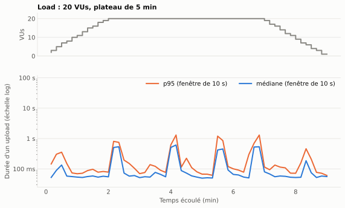
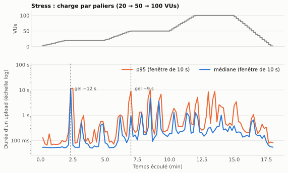
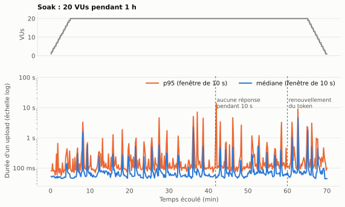
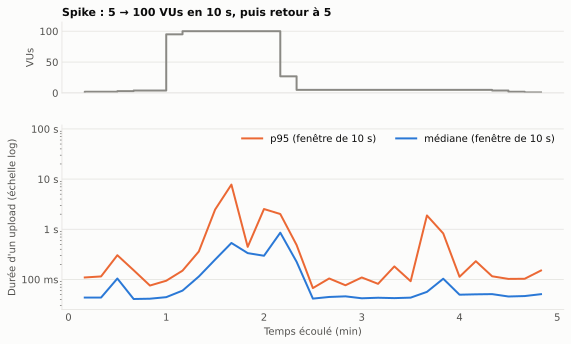

# Performance

Cette page présente les tests de charge de la fonctionnalité d'**upload** (`POST /file`) et l'analyse de leurs résultats. L'upload est la route la plus exigeante de l'API : elle reçoit le fichier, vérifie son type, l'envoie à MinIO, écrit en base et programme un job Redis.

## Méthode

### Outil et scripts

Les tests utilisent **k6**, lancé dans son image Docker officielle. Les scripts sont dans `k6/` :

```text
k6/
├── helpers/upload.js   # logique commune
├── smoke.js            # un fichier par scénario
├── load.js
├── stress.js
├── soak.js
├── spike.js
└── reports/            # rapports HTML exportés
```

Déroulé d'un test :

1. **`setup()`**, une seule fois : création du compte de test (un `401` « compte existant » est accepté), puis connexion pour obtenir un JWT.
2. **Chaque itération d'un utilisateur virtuel (VU)** : envoi d'un fichier texte de **100 Ko** généré en mémoire, avec `expiresInDays: 1`, puis pause d'**1 seconde**.
3. **Vérifications** (`check`) : statut `201` et présence d'un `id` dans la réponse. La métrique `upload_success` enregistre le taux de réussite, `upload_duration` la durée de chaque upload.
4. **Renouvellement du token** : si l'API répond `401` parce que le JWT a expiré (après 1 h), le VU se reconnecte et renvoie le fichier.

### Lancement

```bash
mise run k6 smoke                 # affichage dans le terminal
mise run k6-report load           # + rapport HTML dans k6/reports/
mise run k6 stress --host <IP>    # adresse de l'API si besoin
```

Variables disponibles : `API_HOST`, `API_PORT`, `BASE_URL`, `FILE_SIZE_KB`, `PERF_EMAIL`, `PERF_PASSWORD`.

### Scénarios et seuils

Un test est réussi si tous ses seuils (`thresholds`) sont respectés. Les seuils sont plus tolérants à mesure que la charge devient anormale.

| Scénario | Objectif | Profil de charge | Durée | Seuils |
|---|---|---|---|---|
| **Smoke** | Vérifier que le script et l'API fonctionnent | 2 VUs constants | 1 min | erreurs < 1 %, p95 < 1 s, réussite > 99 % |
| **Load** | Charge normale attendue | 0 → 20 VUs (2 min), 20 VUs (5 min), → 0 (2 min) | 9 min | erreurs < 1 %, p95 < 1,5 s, p99 < 3 s, réussite > 99 % |
| **Stress** | Trouver les limites | Paliers de 3 min à 20, 50 puis 100 VUs | 18 min | erreurs < 5 %, p95 < 3 s, réussite > 95 % |
| **Soak** | Détecter une dégradation dans la durée | 20 VUs pendant 1 h | 70 min | erreurs < 1 %, p95 < 1,5 s, p99 < 3 s, réussite > 99 % |
| **Spike** | Encaisser un pic soudain et s'en remettre | 5 VUs, puis 100 VUs en 10 s pendant 1 min, retour à 5 | 5 min | erreurs < 10 %, p95 < 5 s, réussite > 90 % |

*p95 : 95 % des uploads sont plus rapides que cette durée. p99 : 99 % des uploads.*

### Conditions de mesure

Les tests ont été exécutés le **30 septembre 2026, de 15 h 09 à 17 h 01**, sur le poste de développement :

- k6, l'API NestJS, MinIO et Redis tournent sur **la même machine** ; la base PostgreSQL est **hébergée à distance** (Prisma Postgres).
- Les valeurs mesurent donc ce poste, pas un serveur de production. Elles servent à comparer les scénarios entre eux et à repérer des comportements anormaux, pas à fixer une capacité absolue.

## Résultats

### Synthèse

<div class="perf-summary" markdown>

| Scénario | Uploads | Débit moyen | Médiane | p95 | p99 | Max | Erreurs | Seuils |
|---|---:|---:|---:|---:|---:|---:|---:|:---:|
| Smoke | 114 | 1,9 req/s | 55 ms | 80 ms | 177 ms | 241 ms | 0 % | ✅ |
| Load | 7 506 | 13,9 req/s | 61 ms | 566 ms | 828 ms | 1,6 s | 0 % | ✅ |
| Stress | 38 776 | 35,9 req/s | 181 ms | 1,32 s | 5,13 s | 12,5 s | 0 % | ✅ |
| Soak | 69 786 | 16,6 req/s | 63 ms | 314 ms | 1,01 s | 13,9 s | 0 % | ✅ |
| Spike | 5 209 | 17,9 req/s | 213 ms | 2,25 s | 6,36 s | 8,5 s | 0 % | ✅ |

</div>

*Durées issues de la métrique `upload_duration` (durée de la requête d'upload). Le débit moyen inclut les montées et descentes en charge.*

**Les cinq scénarios respectent tous leurs seuils, sans aucune erreur** : sur plus de 121 000 uploads, chaque réponse a été un `201` avec un identifiant. La fonctionnalité est fiable sous charge. En revanche, les maxima et les p99 montrent des **ralentissements ponctuels importants**, analysés plus bas.

### Smoke

Avec 2 VUs, l'upload répond en **55 ms** en médiane, 80 ms au p95. C'est la **référence** du temps de traitement d'un upload de 100 Ko sans concurrence. Le script, le compte de test et l'infrastructure fonctionnent.

### Load

<figure class="perf-chart" markdown>

</figure>

- Sur le plateau à 20 VUs, le débit est de **17,3 req/s** en moyenne, proche du maximum théorique (20 VUs qui attendent 1 s entre deux envois donnent au plus ~19 req/s). L'API suit donc la charge.
- La médiane reste à **~65 ms** : 20 utilisateurs simultanés ne ralentissent quasiment pas le cas courant.
- En revanche, **toutes les 70 à 110 secondes environ**, une fenêtre de 10 à 20 secondes voit la durée monter à 0,5–1,3 s et le débit chuter de 18 à 12–14 req/s. Ces épisodes expliquent à eux seuls l'écart entre la médiane (61 ms) et le p95 (566 ms).

### Stress

<figure class="perf-chart" markdown>

</figure>

| Palier | Débit | Médiane (par fenêtre) | p95 (par fenêtre) | Fenêtres avec p95 > 1 s |
|---|---:|---:|---:|---:|
| 20 VUs | 17,6 req/s | 61 ms | 213 ms | 0 sur 15 |
| 50 VUs | 35,7 req/s | 173 ms | 309 ms | 7 sur 18 |
| 100 VUs | 65,4 req/s | 275 ms | 697 ms | 8 sur 18 |

*Valeurs typiques : médiane des valeurs mesurées sur chaque fenêtre de 10 s du palier.*

- **Le débit progresse avec la charge** (17 → 36 → 65 req/s) et aucune requête n'échoue, même à 100 VUs. Le point de rupture (apparition d'erreurs) n'est pas atteint à 100 VUs.
- **La latence typique augmente** : de 61 ms à 20 VUs à ~275 ms à 100 VUs. Le débit reste en dessous du maximum théorique (~43 req/s à 50 VUs, ~78 req/s à 100 VUs), ce qui indique que l'API commence à saturer.
- **Les gels deviennent plus fréquents et plus longs** avec la charge. Le plus marquant survient dès 20 VUs, en fin de montée (vers 2 min 20) : pendant ~10 s, l'API ne traite presque plus rien (0,6 req/s) et les uploads en cours attendent jusqu'à **12,5 s**. À 50 et 100 VUs, des gels de 4 à 10 s reviennent toutes les 1 à 2 minutes.
- Le seuil p95 < 3 s est respecté (1,32 s), mais le **p99 atteint 5,1 s** : 1 upload sur 100 subit un gel.

### Soak

<figure class="perf-chart" markdown>

</figure>

| Tranche | Débit | Fenêtres dégradées (p95 > 500 ms) | Pire p95 sur 10 s |
|---|---:|---:|---:|
| 0 – 10 min (montée) | 13,6 req/s | 4 sur 60 | 3,3 s |
| 10 – 20 min | 18,3 req/s | 4 sur 60 | 1,9 s |
| 20 – 30 min | 18,0 req/s | 8 sur 60 | 4,6 s |
| 30 – 40 min | 17,8 req/s | 6 sur 60 | 7,1 s |
| 40 – 50 min | 17,7 req/s | 8 sur 60 | 13,7 s |
| 50 – 60 min | 17,9 req/s | 8 sur 60 | 3,3 s |
| 60 – 70 min (descente) | 13,1 req/s | 12 sur 60 | 8,9 s |

- **Pas de dérive du cas courant** : sur 1 h à 20 VUs, la médiane reste entre 52 et 71 ms et le débit stable autour de 18 req/s. Il n'y a pas de fuite qui ralentirait progressivement toutes les requêtes.
- **Les épisodes de gel deviennent plus fréquents et plus longs** au fil du test : 4 fenêtres dégradées par tranche de 10 minutes au début, 6 à 8 ensuite. Le pire survient à **41 min 50** : aucune réponse pendant 10 secondes, puis des uploads terminés en **13,9 s**.
- **Le renouvellement du token fonctionne** : à 60 min, les JWT expirent, chaque VU reçoit un `401`, se reconnecte et renvoie son fichier. Ces 40 requêtes supplémentaires (20 connexions + 20 nouveaux envois) n'ont provoqué aucun échec.

### Spike

<figure class="perf-chart" markdown>

</figure>

- Pendant le pic à 100 VUs, l'API monte à **84 req/s** au meilleur moment, 56 req/s en moyenne, sans aucune erreur. La latence se dégrade nettement : p95 de 2 s sur la période, et des uploads jusqu'à 8,5 s pendant un gel.
- **La récupération est immédiate** : dans les 10 secondes qui suivent le retour à 5 VUs, la médiane revient à **41 ms**, soit le niveau d'avant le pic.
- Un épisode de ralentissement (p95 de 1,9 s) apparaît encore environ 1 min 20 après le pic, avec seulement 5 VUs.

## Analyse

### Ce qui fonctionne

- **Fiabilité** : 0 erreur sur 121 391 uploads, dans tous les scénarios, y compris à 100 VUs et pendant 1 h.
- **Tenue en charge normale** : à 20 VUs, la médiane reste autour de 60 ms et le débit suit la demande.
- **Élasticité** : l'API absorbe un pic x20 en 10 secondes et revient à la normale aussitôt après.
- **Endurance** : pas de dégradation progressive du cas courant sur 1 h, et renouvellement correct des sessions expirées.

### Le point faible : des gels périodiques

Le même phénomène apparaît dans **tous les scénarios sauf le smoke** : pendant quelques secondes, **tous les VUs sont ralentis en même temps**, le débit s'effondre, puis tout redevient normal. Il se produit dès 20 VUs, plus souvent quand la charge augmente, et plus souvent au fil du temps dans le soak.

Comme toutes les requêtes sont touchées ensemble, la cause est côté serveur et bloque l'ensemble du traitement. k6 mesure le temps de réponse, pas l'intérieur du serveur, donc les causes ci-dessous sont des **hypothèses à vérifier** :

1. **Pauses du ramasse-miettes de Node.js.** Multer est configuré en `memoryStorage` : chaque fichier est entièrement chargé en mémoire avant d'être envoyé à MinIO. À 100 req/s de 100 Ko, cela représente ~10 Mo de tampons à allouer puis libérer chaque seconde. Une collecte majeure bloque la boucle d'événements de Node pendant toute sa durée. Cette hypothèse est cohérente avec la fréquence qui augmente avec la charge.
2. **Latence de la base hébergée.** Chaque upload fait une écriture sur une base PostgreSQL distante. Un ralentissement réseau ou côté hébergeur mettrait en attente toutes les requêtes. Cette hypothèse expliquerait des gels même à charge modérée.
3. **Accumulation dans Redis et MinIO.** Chaque upload ajoute un job différé dans Redis et un objet dans MinIO, qui tournent sur le même poste que k6 et l'API. Leur volume augmente pendant le soak : à la fin, tests précédents compris, plus de 115 000 jobs différés et ~12 Go d'objets, ce qui pourrait expliquer que les épisodes s'aggravent avec le temps.

**Pour trancher**, relancer un load en observant le serveur :

- lancer l'API avec `node --trace-gc` (ou mesurer le retard de la boucle d'événements avec `perf_hooks.monitorEventLoopDelay`) et vérifier si les pauses coïncident avec les gels ;
- suivre `docker stats` pour MinIO et Redis pendant le test ;
- refaire le test avec une base PostgreSQL locale pour isoler l'effet du réseau.

### Recommandations

| Priorité | Action | Effet attendu |
|---|---|---|
| 1 | Identifier la cause des gels avec les mesures ci-dessus | Savoir quoi corriger |
| 2 | Remplacer `memoryStorage` par un envoi en flux vers MinIO (upload multipart S3 à partir du flux de la requête) | Mémoire stable quelle que soit la taille des fichiers ; supprime aussi le risque de saturation avec des fichiers de 1 Go |
| 3 | Refaire le stress et le soak avec des fichiers plus gros (1 à 50 Mo) | Le test actuel (100 Ko) ne mesure pas l'effet de la taille maximale autorisée (1 Go) |
| 4 | Lancer les tests sur une machine séparée de l'API | Des mesures qui ne sont pas faussées par le partage du processeur entre k6, l'API, MinIO et Redis |

### Effet des tests sur les données

Les 5 tests ont créé **121 391 fichiers** (environ **12,5 Go** dans MinIO) sur le compte de test, avec expiration à 1 jour : les jobs BullMQ les suppriment automatiquement le lendemain. Pour nettoyer plus tôt, supprimez le compte de test en base (ses fichiers sont supprimés en cascade) et videz le bucket depuis la console MinIO.

## Rapports complets

Rapports HTML exportés par le tableau de bord k6, avec toutes les métriques et courbes :

- [Smoke](performance/rapports/k6-smoke.html){ target="_blank" }
- [Load](performance/rapports/k6-load.html){ target="_blank" }
- [Stress](performance/rapports/k6-stress.html){ target="_blank" }
- [Soak](performance/rapports/k6-soak.html){ target="_blank" }
- [Spike](performance/rapports/k6-spike.html){ target="_blank" }
