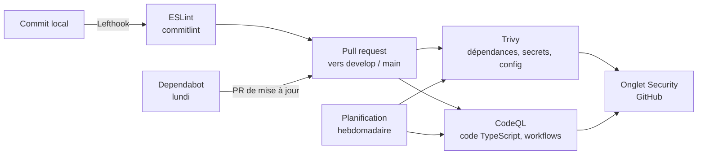

# Sécurité

La sécurité de DataShare repose sur deux volets :

- **dans l'application** : authentification, contrôle des droits, validation des entrées et des fichiers, liens de partage limités dans le temps ;
- **dans la chaîne de développement** : analyse des dépendances, du code et des workflows à chaque PR et chaque semaine, avec des mises à jour automatiques.

La fin de la page liste les risques connus et les corrections prévues.

## Dans l'application

### Authentification et sessions

| Mesure | Mise en œuvre |
|---|---|
| Mots de passe hachés | bcrypt avec sel, coût réglable (`BCRYPT_SALT_ROUND`, 10 par défaut). Le mot de passe en clair n'est jamais stocké. |
| Messages de connexion neutres | Email inconnu et mot de passe faux renvoient la même erreur `401 Bad Credentials` : on ne peut pas savoir si un compte existe via la connexion. |
| Sessions par JWT | Token signé avec `JWT_SECRET`, qui ne contient que l'identifiant de l'utilisateur et expire après `JWT_DURING` (1 h par défaut). |
| Vérification systématique | `JwtAuthGuard` protège tout le contrôleur `/file` : sans `Authorization: Bearer <token>` valide et non expiré, la requête est refusée (`401`). |
| Côté navigateur | `authGuard` bloque l'accès aux pages connectées sans token. L'intercepteur supprime le token et renvoie vers la connexion dès que l'API répond `401`. |

### Contrôle des droits

- Un utilisateur ne voit que **ses** fichiers : `GET /file` filtre sur l'identifiant contenu dans le JWT, jamais sur un paramètre envoyé par le client.
- La suppression et l'expiration forcée vérifient que le fichier appartient à l'utilisateur : sinon `403 Forbidden`, sans rien supprimer. Ces cas sont couverts par des tests unitaires et d'intégration.

### Validation des entrées

- Une `ValidationPipe` globale applique les règles des DTO avec `whitelist: true` : les champs non déclarés sont retirés de la requête avant d'arriver au code.
- Règles principales : email au bon format, mot de passe de compte de 8 caractères minimum, mot de passe de fichier de 6 caractères minimum, durée d'expiration entière entre 1 et 7 jours.

### Fichiers téléversés

| Mesure | Détail |
|---|---|
| Taille limitée | 1 Go maximum, appliqué par Multer avant tout traitement. |
| Type réel vérifié | La bibliothèque `file-type` lit les premiers octets du fichier (magic number), quel que soit son nom ou le `Content-Type` annoncé. Les exécutables et paquets sont refusés (`400`) : `exe`, `dll`, `msi`, `elf`, `deb`, `rpm`, `dmg`, `apk`. |
| Nom de stockage non devinable | Clé MinIO `<userId>/<128 bits aléatoires>-<nom>` : impossible de deviner l'emplacement d'un fichier. |
| Bucket privé | Aucun accès public à MinIO. Le contenu n'est accessible que par une URL présignée. |

### Liens de partage

| Mesure | Détail |
|---|---|
| Token aléatoire | Le lien contient un `downloadToken` (UUID aléatoire), distinct de l'identifiant interne du fichier. |
| Protection optionnelle | Mot de passe haché avec bcrypt ; `400` s'il manque, `401` s'il est faux. |
| Expiration effective | Un lien expiré renvoie `410 Gone`, puis le job BullMQ supprime le fichier de MinIO et de la base : il n'est pas seulement masqué. |
| Accès direct de courte durée | L'URL présignée renvoyée au téléchargement n'est valable que **5 minutes** et force le téléchargement (`Content-Disposition: attachment`) au lieu de l'affichage dans le navigateur. |

### Configuration par environnement

- Swagger UI n'est servi qu'avec `NODE_ENV=development`.
- La route de test `POST /file/:id/force-expire` renvoie `403` avec `NODE_ENV=production`.
- Les secrets (`.env`) sont exclus du dépôt par `.gitignore` ; seuls les fichiers `.env.example`, sans valeurs sensibles, sont versionnés.

## Dans la chaîne de développement

### Trivy : dépendances, secrets et configuration

Workflow `.github/workflows/trivy.yml`.

| Analyse | Ce qu'elle détecte |
|---|---|
| `vuln` | CVE connues dans les dépendances npm des trois `package-lock.json` (racine, backend, frontend) |
| `secret` | Clés, tokens et mots de passe commités par erreur |
| `misconfig` | Erreurs de configuration dans les Dockerfile et fichiers d'infrastructure (le dépôt n'en contient pas encore ; `docker-compose.yml` n'est pas analysé) |

Le workflow fait deux passes :

1. un rapport complet, toutes sévérités, envoyé dans l'onglet **Security > Code scanning** de GitHub (format SARIF) ;
2. un contrôle des vulnérabilités **HIGH** et **CRITICAL** qui ont un correctif disponible, affiché en tableau dans les logs, et qui fait échouer le job.

Une CVE acceptée temporairement se déclare dans un fichier `.trivyignore` à la racine, avec un commentaire qui justifie l'exception.

### CodeQL : analyse statique

Workflow `.github/workflows/codeql.yml`, avec les règles `security-extended`, sur deux langages :

- **`javascript-typescript`** : injections, XSS, chemins non validés, redirections ouvertes… dans le frontend, le backend et les tests ;
- **`actions`** : les workflows GitHub eux-mêmes (injection dans les expressions, permissions trop larges).

Les dossiers générés (`node_modules`, `dist`, `coverage`) et les rapports sont exclus de l'analyse.

### Dependabot : mises à jour

Fichier `.github/dependabot.yml`. Chaque lundi, Dependabot ouvre des PR vers `develop` pour les trois dossiers npm et pour les actions GitHub.

- Les mises à jour sont **regroupées** par famille (Angular, NestJS, Prisma, AWS SDK, dépendances de développement) pour limiter le nombre de PR.
- Un **délai de 5 jours** (`cooldown`) évite d'adopter une version publiée la veille, qui pourrait être compromise. Les correctifs de sécurité ne sont pas retardés.
- Les messages de commit (`chore(deps): …`, `ci: …`) respectent le format imposé par commitlint.

### Déclenchement et blocage

| Événement | Trivy | CodeQL |
|---|---|---|
| PR vers `develop` | Informatif (le job ne bloque pas) | Analyse, alertes dans la PR |
| PR vers `main` | **Bloquant** sur HIGH/CRITICAL | Analyse, alertes dans la PR |
| Push sur `main` | **Bloquant** | Analyse |
| Planifié | Chaque lundi, 5 h UTC | Chaque jeudi, 5 h UTC |
| Manuel | `workflow_dispatch` | `workflow_dispatch` |

L'analyse planifiée est indispensable pour Trivy : une nouvelle CVE peut être publiée sur une dépendance sans qu'aucun code ne change. Si elle est critique, le job échoue et GitHub prévient par email.

CodeQL ne fait jamais échouer son job. Pour qu'il bloque le merge sur `main`, il faut activer la règle **Require code scanning results** (outil CodeQL, seuil *High or higher*) dans *Settings > Rules > Rulesets*.

### Sécurité de la CI elle-même

- **Actions épinglées par SHA de commit** plutôt que par tag. En mars 2026, des tags de `aquasecurity/trivy-action` ont été réécrits pour pointer vers du code qui volait les secrets des pipelines ; un workflow épinglé par SHA n'exécute que le code vérifié. Dependabot met ces SHA à jour.
- **Versions sûres** : `trivy-action` v0.36.0 et Trivy v0.70.0, publiées après l'incident (les binaires 0.69.4 à 0.69.6 étaient compromis).
- **Permissions minimales** : `contents: read` par défaut, `security-events: write` uniquement pour les jobs qui publient des résultats.
- **`persist-credentials: false`** au checkout : le token GitHub n'est pas conservé dans le dépôt cloné.

### Outillage local

- **Lefthook** lance ESLint sur les fichiers modifiés avant chaque commit.
- **commitlint** impose le format Conventional Commits, ce qui rend l'historique lisible et facilite l'identification d'un changement à risque.

## Risques connus et plan d'action

Ces points ont été relevés lors de la revue du code. Ils sont classés par priorité.

| Priorité | Risque | Détail | Correction proposée |
|---|---|---|---|
| **Haute** | Hash du mot de passe renvoyé à l'inscription | `POST /auth/register` renvoie l'objet utilisateur complet, y compris `passwordHash`. Le test d'intégration vérifie `password` au lieu de `passwordHash` et ne le détecte pas. | Renvoyer seulement `id` et `email` (`select` Prisma ou DTO de réponse) et corriger le test. |
| **Haute** | Pas de limitation du nombre de tentatives | `/auth/login` et `POST /download/:token` acceptent un nombre illimité d'essais. Un mot de passe de fichier de 6 caractères peut être attaqué par force brute. | Ajouter `@nestjs/throttler` sur ces routes. |
| **Haute** | Uploads chargés entièrement en mémoire | Avec `memoryStorage` et une limite de 1 Go, quelques uploads simultanés de gros fichiers peuvent saturer la mémoire du serveur (déni de service). Voir aussi [Performance](performance.md). | Envoyer le fichier en flux vers MinIO, ou baisser la limite. |
| Moyenne | CORS ouvert par défaut | Sans `ALLOW_ORIGIN`, toute origine peut appeler l'API. | Définir `ALLOW_ORIGIN` avec l'URL du frontend hors développement. |
| Moyenne | Nom de fichier non assaini dans `Content-Disposition` | Le nom d'origine est inséré tel quel entre guillemets dans l'en-tête de l'URL présignée. Un nom contenant `"` peut casser l'en-tête. | Échapper le nom ou utiliser la forme `filename*=UTF-8''…`. |
| Moyenne | JWT stocké dans le `localStorage` | Une faille XSS permettrait de lire le token. Angular échappe les données affichées, ce qui limite ce risque. | Cookie `HttpOnly`, `Secure`, `SameSite` si l'application est déployée. |
| Moyenne | Identifiants MinIO par défaut | Le code se rabat sur `minioadmin`/`minioadmin` si les variables manquent. | Supprimer ces valeurs par défaut hors développement et faire échouer le démarrage. |
| Moyenne | Pas d'en-têtes de sécurité HTTP | Pas de `helmet` sur l'API. | Ajouter `helmet()` dans `main.ts`. |
| Basse | Existence d'un compte révélée à l'inscription | `POST /auth/register` répond `401 User already exists`. | Compromis courant pour l'ergonomie ; à combiner avec la limitation des tentatives. |
| Basse | Déconnexion côté client seulement | Un JWT reste valide jusqu'à son expiration, même après déconnexion. | Durée courte (1 h actuellement) ou liste de révocation. |
| Basse | Scripts texte non détectés | `.sh`, `.bat`, `.js`… n'ont pas de signature binaire et passent la vérification. | Acceptable ici, car les fichiers ne sont jamais exécutés par le serveur et sont servis en téléchargement. |
| Basse | Images Docker en `latest` | `minio/minio:latest` et `minio/mc:latest` peuvent changer sans prévenir. | Épingler une version datée. |
| Basse | Transport en clair en local | API et MinIO en `http://`. | HTTPS obligatoire en déploiement (reverse proxy ou TLS MinIO). |
