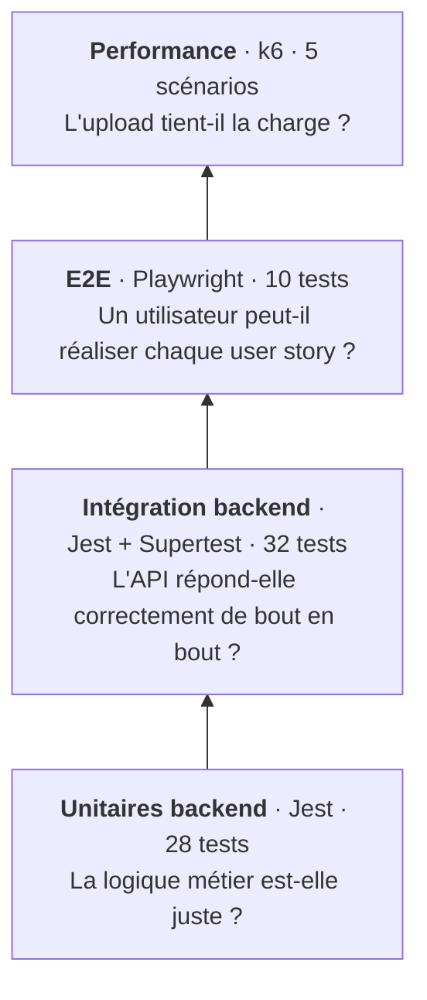

# Tests

## Stratégie

Les tests suivent une **pyramide** : beaucoup de tests rapides et isolés à la base, moins de tests lents et complets au sommet. Chaque niveau répond à une question différente.



| Niveau | Outil | Ce qui est réel | Ce qui est simulé | Durée |
|---|---|---|---|---|
| Unitaire backend | Jest, ts-jest | Le service ou le guard testé | Prisma, MinIO, BullMQ, JWT (mocks `jest.fn()`) | Quelques secondes |
| Intégration backend | Jest, Supertest | Toute l'application Nest, PostgreSQL, MinIO, Redis | Rien | Dizaines de secondes |
| E2E | Playwright (Chromium) | Navigateur, frontend, backend, infrastructure | Rien | ~15 s |
| Unitaire frontend | Vitest (jsdom) | Composant `App` | DOM (jsdom) | Quelques secondes |
| Performance | k6 | Backend et infrastructure | Le navigateur (appels HTTP directs) | 1 min à 70 min |

**Principes retenus**

- La logique critique (droits sur les fichiers, mots de passe, expiration) est testée **à la fois** en unitaire, pour couvrir chaque branche rapidement, et en intégration, pour vérifier les vrais codes HTTP et la validation des DTO.
- Les tests E2E couvrent **un parcours par user story** : ils vérifient que tout s'assemble, pas chaque cas d'erreur.
- Chaque cas d'erreur de l'API (`400`, `401`, `403`, `404`, `410`) a au moins un test d'intégration.
- Les éléments ciblés par Playwright portent un attribut `test-id` dédié, indépendant des classes CSS et des textes.

## Couverture fonctionnelle

| User story | Unitaires | Intégration | E2E |
|---|---|---|---|
| US01 – Téléverser | — | 6 (`POST /file`) | 1 |
| US02 – Télécharger | 9 (`DownloadService`) | 10 (`/download/:token`) | 1 |
| US03 – Créer un compte | 2 (`AuthService.register`) | 5 (`POST /auth/register`) | 3 |
| US04 – Connexion / déconnexion | 3 (`AuthService.login`) + 4 (`JwtAuthGuard`) | 3 (`POST /auth/login`) | 3 |
| US05 – Historique | — | 2 (`GET /file`) | 1 |
| US06 – Supprimer | 3 (`FileService.remove`) | 3 (`DELETE /file/:id`) | 1 |
| Expiration automatique | 2 (`FileProcessor`) + 4 (`FileService.forceExpire`) | 3 (`force-expire`) | — |

## Tests unitaires backend

Emplacement : `backend/src/**/*.spec.ts`, à côté du code testé.

Chaque test construit un module Nest avec `Test.createTestingModule()` et remplace les dépendances par des objets simulés. Exemple avec `FileService` : Prisma, `StorageService` et la file BullMQ sont des mocks, ce qui permet de vérifier qu'une suppression par un autre utilisateur lève `ForbiddenException` **et** n'appelle jamais `storage.delete()`.

| Fichier | Tests | Ce qui est vérifié |
|---|---|---|
| `auth/auth.service.spec.ts` | 5 | Hachage du mot de passe, email en double, connexion valide, utilisateur inconnu, mauvais mot de passe |
| `auth/jwt-guard.spec.ts` | 4 | En-tête absent, mauvais schéma, token invalide, injection de `request.user` |
| `download/download.service.spec.ts` | 9 | Métadonnées, `404`, `410`, mot de passe manquant (`400`) ou faux (`401`), URL présignée |
| `file/file.service.spec.ts` | 7 | Suppression et expiration forcée : propriétaire, `403`, `404`, job absent |
| `file/file.processor.spec.ts` | 2 | Suppression à l'expiration, fichier déjà supprimé |
| `app.controller.spec.ts` | 1 | Route par défaut |

```bash
cd backend
npm test            # tous les tests unitaires
npm run test:cov    # avec couverture → backend/coverage/unit/
```

## Tests d'intégration backend

Emplacement : `backend/test/*.int-spec.ts`, configuration `backend/test/jest-int.json`.

`createTestApp()` démarre l'`AppModule` complet avec la même `ValidationPipe` que `main.ts`. Supertest envoie de vraies requêtes HTTP. Chaque test crée ses utilisateurs (`registerAndLogin()`), puis `cleanDatabase()` vide la base après chaque test. Les tests s'exécutent en série (`--runInBand`) car ils partagent la même base.

| Fichier | Tests | Routes |
|---|---|---|
| `auth.int-spec.ts` | 8 | `POST /auth/register`, `POST /auth/login` |
| `file.int-spec.ts` | 14 | `POST /file`, `GET /file`, `DELETE /file/:id`, `POST /file/:id/force-expire` |
| `download.int-spec.ts` | 10 | `GET /download/:token`, `POST /download/:token` |

Cas notables : rejet d'un exécutable Windows construit en mémoire et reconnu par sa signature binaire `MZ`/`PE`, isolation des historiques entre deux utilisateurs, suppression refusée à un autre utilisateur, lien expiré (`410`).

```bash
mise run docker-up     # MinIO + Redis
cd backend
npm run test:int
```

!!! danger "Les tests d'intégration vident la base"
    `cleanDatabase()` exécute `prisma.user.deleteMany()`, donc supprime **tous** les utilisateurs et, par cascade, tous les fichiers de la base pointée par `DATABASE_URL`. Lancez-les uniquement sur une base dédiée aux tests, jamais sur la base de développement partagée.

## Tests de bout en bout (Playwright)

Emplacement : `frontend/playwright/`, configuration `frontend/playwright.config.ts`.

```text
playwright/
├── 01-us03-account-creation.spec.ts
├── 02-us04-user-login-logout.spec.ts
├── 03-us01-us02-upload-download.spec.ts
├── 04-us05-history.spec.ts
├── 05-us06-delete-file.spec.ts
├── fixtures/index.ts         # test étendu : selector() + couverture automatique
├── helpers/                  # selector(), login()
├── data/                     # user.json, test-file.txt
├── coverage.config.ts        # options monocart
├── global-setup.ts           # vide le cache de couverture
└── global-teardown.ts        # génère le rapport de couverture
```

**Fonctionnement**

- Un seul worker (`workers: 1`) et des fichiers numérotés : les fichiers s'exécutent dans l'ordre, car les scénarios s'enchaînent (le compte créé en 01 sert à se connecter en 02, le fichier téléversé en 03 apparaît dans l'historique en 04 puis est supprimé en 05).
- Dans le fichier 03, `test.describe.serial` partage le lien de partage entre le test de téléversement et le test de téléchargement.
- Les tests importent `test` depuis `fixtures/` : la fixture `selector('nom')` cible `[test-id=nom]`, et la fixture automatique `autoCollectCoverage` enregistre la couverture JavaScript de chaque test.
- Les téléchargements sont vérifiés avec l'événement `download` (nom du fichier reçu), les appels d'API avec `waitForRequest` (corps envoyé et statut `201`), et la boîte de confirmation de suppression est acceptée avec `page.once('dialog', …)`.
- `webServer` démarre le frontend (`npm run start`) ; le backend et Docker doivent déjà tourner.

```bash
mise run docker-up && mise run dev-back   # dans un autre terminal
cd frontend
npm run play:run      # tests + couverture
npm run play:open     # mode interface
npm run play:report   # rapport HTML des tests
```

**Dernier résultat enregistré** (rapport du 30/09/2026) : **10 tests sur 10 réussis** en 13,6 s, dans Chromium.

### Couverture du code Angular

La couverture est mesurée par le moteur V8 de Chromium pendant les tests, puis rapportée au code TypeScript grâce aux source maps du serveur de développement. Aucune instrumentation du build n'est nécessaire.

1. `global-setup.ts` vide le cache de couverture.
2. La fixture démarre `page.coverage.startJSCoverage()` avant chaque test et envoie le résultat à monocart après.
3. `global-teardown.ts` génère le rapport dans `frontend/coverage/e2e/` (HTML V8, `lcov.info` et résumé dans le terminal).

Seul le code de `src/app/` servi par `localhost:4200` est compté. La couverture n'est disponible que dans Chromium. Lancer un seul fichier de test produit un rapport limité à ce fichier.

## Tests unitaires frontend

`frontend/src/app/app.spec.ts` contient 2 tests Vitest (`npm test`). Le second cherche un titre « Hello, mon-projet-front » qui n'existe plus depuis que `app.html` ne contient que `<router-outlet>` : il échoue et doit être supprimé ou réécrit. La logique du frontend est aujourd'hui couverte par les tests E2E.

## Couverture du backend

```bash
cd backend
npm run test:cov:merge
```

Le script lance les tests unitaires puis d'intégration avec couverture, fusionne les deux rapports avec `nyc`, et écrit le rapport HTML dans `backend/coverage/report/`. Sont exclus du calcul : les DTO, interfaces, modules, `main.ts`, le client Prisma généré et le contrôleur par défaut.

## Performance

Les 5 scénarios k6 et l'analyse de leurs résultats sont détaillés sur la page [Performance](performance.md).

## Points d'attention

| Constat | Conséquence | Correction proposée |
|---|---|---|
| Le test E2E d'inscription utilise toujours `test2@test2.com` | Il échoue dès le deuxième lancement sur la même base (compte existant) | Générer un email unique pour ce test et créer le compte de `user.json` dans un setup |
| Les fichiers E2E dépendent les uns des autres | Un échec en 01 ou 03 entraîne des échecs en cascade | Préparer les données par API dans une fixture ou un projet `setup` |
| Le `describe` de `04-us05-history.spec.ts` s'appelle « US06 - Delete File » | Rapport trompeur | Renommer en « US05 - History » |
| Le test d'inscription vérifie `body.password`, mais le champ renvoyé s'appelle `passwordHash` | Le test passe alors que le hash est renvoyé au client (voir [Sécurité](securite.md)) | Vérifier `body.passwordHash` |
| `reporter` écrit dans `tests/reports`, alors que le rapport versionné est dans `playwright/reports` | Deux emplacements, rapport versionné obsolète | Utiliser `playwright-report/` (déjà ignoré par git) |
